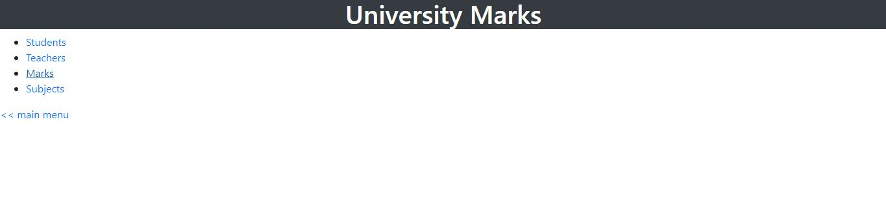
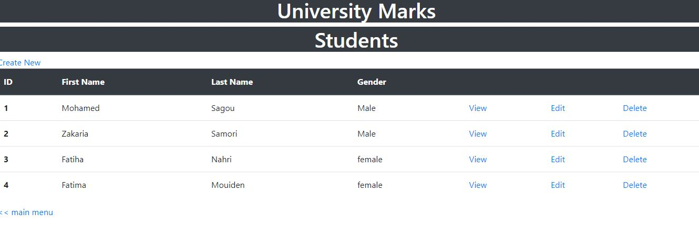
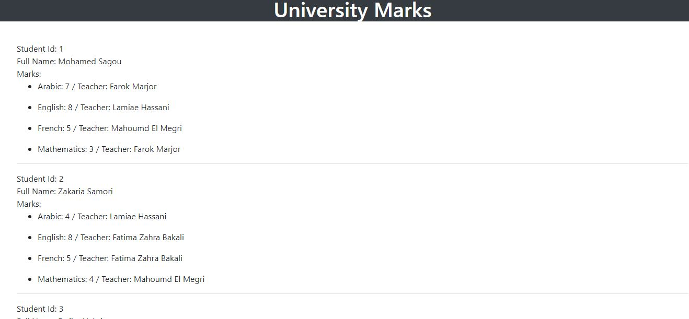

# SAGOU MOHAMED - Manage students marks - project to improve

This is a project from my.

## Table of contents

- [Overview](#overview)
  - [The challenge](#the-challenge)
  - [Screenshot](#screenshot)
  - [Links](#links)
- [My process](#my-process)
  - [Built with](#built-with)
  - [What I learned](#what-i-learned)
  - [Continued development](#continued-development)
  - [Useful resources](#useful-resources)
- [Author](#author)
- [Acknowledgments](#acknowledgments)


## Overview

### The challenge

About the project:

- A student may enroll more than one suject.
- A teacher could teach more than one subject
- A subject can be affected to more than one teacher for different classes
- We need to keep trach of each student's mark
- Create, Read, interfaces for:
  - Students
  - Subjects
  - Teachers
  - Marks

### Screenshot





### Links

- Solution URL: [Add solution URL here](https://your-solution-url.com)
- Live Site URL: [Add live site URL here](https://your-live-site-url.com)

## My process

### Built with

- php
- html
- css
- bootstrap


### What I learned


```php
<?php require_once('../../../private/ini.php') ?>
<?php include(SHARED_PATH .'/header.php') ?>
<?php   $marks_data = [
    ['student_id' => '1', 'first_name' => 'Mohamed', 'last_name' => 'Sagou', 'gender' => 'M','date_of_birth' => '10/01/2002', 'marks'=>['Arabic'=>[7,2],'English'=> [8,3], 'French' => [5,1], 'Mathematics'=> [3,2]]],
    ['student_id' => '2', 'first_name' => 'Zakaria', 'last_name' => 'Samori', 'gender' => 'M','date_of_birth' => '10/03/2001', 'marks'=>['Arabic'=> [4,3] ,'English'=> [8,4], 'French' => [5,4], 'Mathematics'=> [4, 1]]],
    ['student_id' => '3', 'first_name' => 'Fatiha', 'last_name' => 'Nahri', 'gender' => 'F','date_of_birth' => '10/08/2000', 'marks'=>['Arabic'=> [10,2], 'English'=> [8,3], 'French' => [5,1], 'Mathematics'=> [9,2]]],
    ['student_id' => '4', 'first_name' => 'Fatima', 'last_name' => 'Mouiden', 'gender' => 'F','date_of_birth' => '04/11/1999', 'marks'=>['Arabic'=> [6,3] ,'English'=> [9,4], 'French' => [10,4], 'Mathematics'=> [8, 1]]],
  ];
   ?>

<?php if($_SERVER['REQUEST_METHOD'] == 'GET'){
    $teacher_id = isset($_GET['teacher_id'])? $_GET['teacher_id']: '';
    $subject_name = isset($_GET['subject_name'])? $_GET['subject_name'] : '';

    $student_to_show = [];
    foreach($marks_data as $student){
        foreach($student['marks'] as $subject => $marks_teacher_id){
            if($marks_teacher_id[1] == $teacher_id){
                array_push($student_to_show, $student['student_id'].', '.$subject.': '.$marks_teacher_id[0]);
            }
        }
    }
    $container =[];
    foreach($student_to_show as $student){
        $student_show_array = [];
        $student_array = explode(", ", $student);
        $student_show_array['student_id'] = $student_array[0];
        $student_show_array['marks'] =  $student_array[1];
        array_push($container, $student_show_array);
    }

    $main_subject_container = [];

    foreach($container as $student){
        $subject = explode(': ',$student['marks']);
        if($subject[0] == $subject_name){
            array_push($main_subject_container, $student);
        }
    }


} ?>

<?php
$id = isset($_GET['id'])? $_GET['id'] : '';
$subject_name = isset($_GET['subject_name'])? $_GET['subject_name'] : '';
$teachers = isset($_GET['teachers'])? urldecode($_GET['teachers']) : '';
$teachers_array = explode(", ", $teachers);
$teacherfirst = explode(",", $teachers_array[0]);
$teachersecond = explode(",", $teachers_array[1]);
?>
<div class="display-detail">
<?php
    echo 'Subject Id : '.$id.'<br>';
    echo 'Subject Name : '.$subject_name.'<br>';
    echo 'Student marks of the teacher : <ul>

    <li><a href="'.url_for('/interfaces/marks/show.php?id='.$id.'&subject_name='.$subject_name.'&teachers='.urlencode($teachers)).'&teacher_id='.urlencode($teacherfirst[0]).'">'.$teacherfirst[1].'</a></li>

    <li><a href="'.url_for('/interfaces/marks/show.php?id='.$id.'&subject_name='.$subject_name.'&teachers='.urlencode($teachers)).'&teacher_id='.urlencode($teachersecond[0]).'">'.$teachersecond[1].'</a></li>

     </ul><br>';
    // echo '<a href="#">Student marks >></a>';  to marks pages
    ?>
</div>
<?php foreach ($main_subject_container as $student){
        echo 'Student Id: '.$student['student_id'].'<br>Full Name: '.$marks_data[(int) $student['student_id'] - 1]['first_name'].' '.$marks_data[(int) $student['student_id'] - 1]['last_name'].'<br>'.'Subjects Marks: '.$student['marks'].'<br><br>';
    } ?>

    <br>
    <br>
<a href="<?php echo url_for('/interfaces/marks/index.php') ?>"><< Back</a>
<br>
<?php include(SHARED_PATH .'/footer.php') ?>
```


### Continued development

Im very motivated to learn sql so I can complet this project.


### Continued development

My first project with menu, Im so glad for finishing this work. Specialy the mobile version with the side menu on the right.


### Useful resources

- [W3schools](https://www.w3schools.com/) - This helped me for javaScript eventListener. I really liked this pattern and will use it going forward.
- [stackoverflow](https://stackoverflow.com/) - this website help me on the javascript when i get stuck.
## Author

- Website - [Mohamed Sagou](https://github.com/medsagou)
- Frontend Mentor - [@medsagou](https://www.frontendmentor.io/profile/medsagou)
- Twitter - [@sagoumohamed](https://www.twitter.com/sagoumohamed)

## Acknowledgments

nothing for this project.
